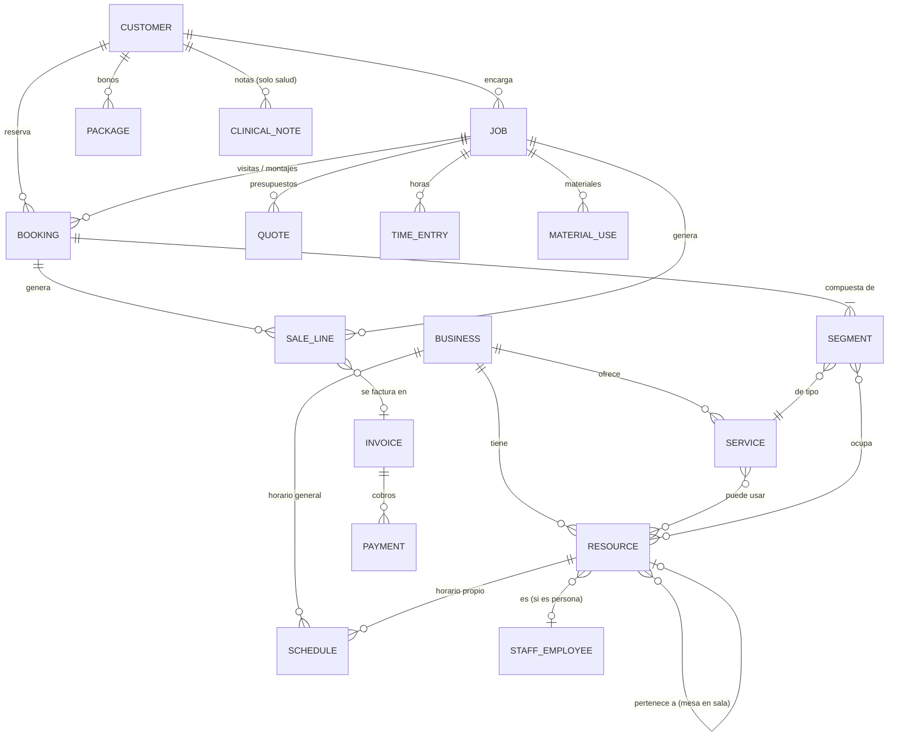

# Modelo de datos genérico: citas, reservas y trabajos

Propuesta para que una misma base sirva a un restaurante, una peluquería, una consulta de psicología y una carpintería. Está pensada para MongoDB/Mongoose y para la estructura `core / modules / verticals` del repo.

## 1. La idea en una frase

Casi cualquier negocio de servicios hace una de dos cosas, o las dos:

- **Agenda:** el cliente reserva un hueco con un servicio que consume recursos durante un tiempo. Es el caso del restaurante, la peluquería y el psicólogo.
- **Trabajo por presupuesto:** el cliente pide algo, recibe un presupuesto, lo acepta y se ejecuta en una o varias visitas. Es el caso de la carpintería.

Las dos acaban en lo mismo: **líneas de venta → factura → cobro**. El modelo pone en común lo que comparten y deja a cada sector solo su configuración.

| Concepto común | Restaurante | Peluquería | Psicólogo | Carpintería |
|---|---|---|---|---|
| **Recurso** | mesa, sala | profesional, sillón | psicóloga, despacho | carpintero, furgoneta, taller |
| **Servicio** | comida, cena | corte, tinte, mechas | sesión 50 min, primera visita | visita de medición, montaje |
| **Reserva (Booking)** | mesa para 4 a las 21:00 | corte con Ana + tinte | sesión semanal los martes | día de montaje en casa del cliente |
| **Trabajo (Job)** | — (eventos privados) | — | — | armario a medida: presupuesto → fabricación → montaje |
| **Capacidad** | plazas por mesa / aforo | 1 cliente por profesional | 1 paciente | horas de equipo |

## 2. Diagrama



## 3. Entidades

Todas llevan `businessId`, que es lo que ya garantiza hoy el aislamiento entre negocios.

### 3.1 Resource (recurso): sustituye a `Table` y `Room`

Cualquier cosa o persona con agenda propia que un servicio necesita.

```js
{
  businessId,
  kind: 'staff' | 'space' | 'equipment',
  name: 'Mesa 7' | 'Ana' | 'Despacho 2' | 'Furgoneta',
  parentId: null,          // mesa → sala, sillón → local
  capacity: 4,             // plazas (mesa) o clientes simultáneos (profesional = 1)
  minCapacity: 2,          // no dar una mesa de 6 a 1 persona
  combinableWith: [],      // mesas que se pueden juntar (como hoy tableIds)
  staffEmployeeId: null,   // enlaza con modules/staff si kind === 'staff'
  bookableOnline: true,
  attributes: {},          // lo específico: forma y ángulo de la mesa, color en agenda...
  active: true,
}
```

### 3.2 Schedule (horario): sustituye a `Shift`, `Vacation` y `Exception`

Un único sistema de reglas semanales más excepciones por fecha, como Cal.com y Odoo. Puede pertenecer al negocio (horario de apertura) o a un recurso (jornada de Ana).

```js
{
  businessId,
  ownerType: 'business' | 'resource',
  ownerId,
  timezone: 'Europe/Madrid',
  rules: [                         // semana tipo
    { days: [2,3,4,5,6], start: '09:00', end: '14:00', label: 'Mañana' },
    { days: [2,3,4,5,6], start: '16:00', end: '20:00', label: 'Tarde' },
  ],
  overrides: [                     // excepciones por fecha
    { date: '2026-12-24', closed: true, reason: 'Nochebuena' },
    { from: '2026-08-01', to: '2026-08-31', closed: true, reason: 'Vacaciones' },
    { date: '2026-10-17', rules: [{ start: '09:00', end: '13:00' }] },
    { date: '2026-10-18', mode: 'phone_only', message: 'Solo por teléfono' }, // = Exception 'call'
  ],
}
```

La disponibilidad real de un hueco es el horario del negocio, cruzado con el horario del recurso, menos las reservas que ya ocupan ese recurso.

### 3.3 Service (servicio): el catálogo

Es la pieza que hace el modelo genérico: cada servicio dice **qué recursos consume, cuánto tiempo y cómo se cobra**.

```js
{
  businessId,
  name: 'Corte + lavado',
  category: 'Cortes',
  durationMin: 45,
  bufferBeforeMin: 0, bufferAfterMin: 10,      // limpiar el sillón, preparar la sala
  slotIntervalMin: 15,                          // cada cuánto se ofrecen horas
  bookingMode: 'slot' | 'quote',                // 'quote' = carpintería: no se reserva, se presupuesta
  capacityMode: 'resource' | 'pool',            // 'pool' = aforo global por franja (maxPeoplePerSlot actual)
  partySize: { min: 1, max: 1 },                // restaurante: {min:1, max:20}
  requirements: [                               // qué necesita del inventario de recursos
    { kind: 'staff', count: 1, resourceIds: ['ana', 'luis'], customerCanChoose: true },
    { kind: 'space', count: 1, optional: true },
  ],
  price: { amount: 2500, currency: 'eur', from: false }, // céntimos; from=true → "desde 25 €"
  tax: { rate: 21, exemptReason: null },         // psicología clínica: rate 0, exemptReason 'art20_sanitario'
  onlineBooking: { enabled: true, minNoticeHours: 2, maxDaysAhead: 60, requireApproval: false },
  payment: { mode: 'none' | 'deposit' | 'full' | 'card_guarantee', amount: 0, perPerson: false,
             freeCancellationHours: 24, noShowFee: 0 },
  staffCommission: { percent: 40 },               // peluquería: comisión por servicio realizado
}
```

Ejemplos de configuración:

- **Restaurante, "Cena":** 90 min, `partySize 1–20`, requiere 1 recurso `space` con `capacity >= partySize` (se pueden combinar mesas), franjas cada 30 min, depósito opcional por persona.
- **Peluquería, "Tinte":** 90 min, requiere 1 `staff` de una lista, el cliente puede elegir profesional o "cualquiera".
- **Psicólogo, "Sesión":** 50 min, 10 min de margen, requiere la psicóloga y un despacho (o "online"), IVA exento.
- **Carpintería, "Visita de medición":** 60 min, reservable online. "Armario a medida" usa `bookingMode: 'quote'`.

### 3.4 Booking (reserva o cita): sustituye a `Reservation`

Siguiendo el modelo de Square, una reserva está formada por **segmentos**. Así se cubre "corte con Ana y luego tinte con Luis" sin inventar nada nuevo.

```js
{
  businessId, customerId,
  status: 'pending' | 'confirmed' | 'checked_in' | 'completed' | 'cancelled' | 'no_show',
  start, end,                                   // instantes UTC (hoy: date + time en texto)
  partySize: 4,
  segments: [
    { serviceId, start, durationMin: 45, resourceIds: ['ana', 'sillon-2'], anyStaff: false },
    { serviceId, start, durationMin: 90, resourceIds: ['luis'] },
  ],
  source: 'online' | 'phone' | 'walk_in' | 'thefork',
  seriesId: null,                               // citas recurrentes (psicología semanal)
  jobId: null,                                  // si es una visita de un trabajo (carpintería)
  packageId: null,                              // si descuenta de un bono
  notes: '', internalNotes: '',
  payment: { ... },                             // se reutiliza el subdocumento actual
  publicToken, reminderSentAt, promoCodeId,     // igual que hoy
}
```

Para que dos reservas no ocupen el mismo recurso a la vez, lo más fiable es una colección auxiliar `ResourceOccupancy` con un documento por recurso y franja, con índice único. El `keyedLock` actual solo funciona con una instancia del servidor.

### 3.5 Job (trabajo o proyecto): solo para quien trabaja por encargo

```js
{
  businessId, customerId,
  title: 'Armario empotrado dormitorio',
  status: 'lead' | 'quoted' | 'accepted' | 'in_progress' | 'done' | 'invoiced' | 'lost',
  address: { ... },                             // se trabaja en casa del cliente
  acceptedQuoteId,
  dueDate,
  assignedResourceIds: ['carpintero-1'],
}
```

Colecciones asociadas:

- **Quote (presupuesto):** líneas, validez, estado (`draft/sent/accepted/rejected`) y versión
- **TimeEntry:** horas de cada trabajador en el trabajo, que alimentan el coste real y la facturación por horas
- **MaterialUse:** productos de `modules/purchases` consumidos en el trabajo, que dan coste real y stock
- **Booking** con `jobId`: la visita de medición, los días de montaje y las revisiones

### 3.6 SaleLine, Invoice y Payment: el tramo final común

- **SaleLine:** una línea vendida, sea un servicio hecho, un producto (un champú), horas o material. Tiene `sourceType` (`booking | job | pos`), cantidad, precio, `taxRate` y `exemptReason`. Aquí se calculan las comisiones y los ingresos reales, en lugar de estimarlos con ticket medio por cubierto como hoy.
- **Invoice:** agrupa líneas y guarda número, serie, totales por tipo de IVA, estado, `externalProvider` y `externalId`.
- **Payment:** importe, método (tarjeta, efectivo, Bizum, Stripe) y referencia a la reserva, factura o depósito.

**Recomendación importante:** que Vetra no emita la factura legal. La factura se debería **enviar a un programa homologado** (Holded, Quipu o similar) por API y guardar aquí solo la referencia. VeriFactu será obligatorio desde el 1 de enero de 2027 para sociedades y desde el 1 de julio de 2027 para autónomos, y los fabricantes de software ya tienen obligaciones propias desde julio de 2025, como la declaración responsable. Construirlo tú es otro producto entero.

### 3.7 Piezas pequeñas pero necesarias

- **Package (bono):** "10 sesiones" o "5 cortes": servicio, total, usadas y caducidad. Muy común en psicología y peluquería.
- **Customer:** se reutiliza el actual; `visits`, `noShowCount` y el consentimiento de marketing ya sirven para todos los sectores.
- **ClinicalNote**, solo en la vertical de salud: son **datos de salud, una categoría especial del RGPD**. Van en una colección aparte, con acceso solo para el profesional que atiende (no para el recepcionista), cifrado de campo y registro de quién las lee. No deben mezclarse nunca con `Customer.notes`.

## 4. Qué pone cada vertical

Con este modelo, una vertical pasa a ser sobre todo **configuración**, más la poca lógica que no se puede generalizar:

| Vertical | Configuración | Lógica propia |
|---|---|---|
| Restaurante | recursos = mesas y salas; servicios = comida y cena; `partySize`; aforo por franja | asignación de mesas y combinación; plano de sala; integración TheFork |
| Peluquería | recursos = profesionales; catálogo de servicios; comisiones | reservas de varios servicios seguidos; "cualquier profesional" |
| Psicólogo | recursos = profesional y despacho; sesiones exentas de IVA | citas recurrentes; notas clínicas; videollamada |
| Carpintería | recursos = equipo y furgoneta; servicios de visita | presupuestos → trabajo → partes de horas y material |

En cada vertical también cambian los **textos**: "mesa", "sillón" o "despacho", y "comensales", "cliente" o "paciente". Eso va en su `business.js` o en un archivo de terminología, igual que ya hicimos con los campos del negocio.

## 5. De dónde sale cada idea

- **Segmentos dentro de una reserva, con un profesional por segmento y "cualquiera":** así lo modela [Square Bookings](https://developer.squareup.com/reference/square/objects/AppointmentSegment).
- **Horario semanal más excepciones por fecha, y en cada tipo de servicio duración, intervalo, márgenes y antelación mínima:** así lo modela [Cal.com](https://deepwiki.com/calcom/cal.com/2.3-scheduling-and-availability-logic).
- **Distinguir recursos humanos de recursos físicos (salas, mesas), con capacidad y combinación de recursos:** así lo modela [Odoo Appointments](https://www.odoo.com/documentation/19.0/applications/productivity/appointments.html).
- **Del presupuesto al trabajo, y del trabajo a horas, material y factura:** es el flujo de [Odoo Field Service](https://www.odoo.com/documentation/19.0/applications/services/field_service/creating_tasks.html).
- **IVA de psicología:** la exención depende del tipo de servicio (diagnóstico o tratamiento), no del profesional; informes periciales, formación o coaching llevan IVA ([Eholo](https://www.eholo.health/blog/iva-psicologos-exencion-factura)). Por eso el IVA va en el servicio y no en el negocio.
- **Fechas de VeriFactu:** [MuyPymes](https://www.muypymes.com/2026/09/07/verifactu-obligatorio-2027-autonomos-pymes-sociedades-fechas) (Real Decreto-ley 15/2025).

## 6. Cómo llegar desde Vetra sin romper nada

1. **No migrar el restaurante primero.** El modelo nuevo se construye como `modules/bookings` (Resource, Schedule, Service, Booking) y se estrena con la primera vertical nueva, por ejemplo la peluquería.
2. Cuando funcione en producción con ese cliente, se escribe un **adaptador de restaurante**: mesa → Resource, turno → Schedule y Service, reserva → Booking de un segmento. Se migra con un script idempotente y la foto de rutas asegura que la API no cambia.
3. `SaleLine` e `Invoice` (a través de un proveedor externo) se añaden cuando el primer cliente necesite facturar.
4. `Job` y `Quote` solo cuando aparezca el primer negocio que trabaje por encargo.

Así cada pieza nace con un cliente real que la paga, y Vetra sigue funcionando igual mientras tanto.
